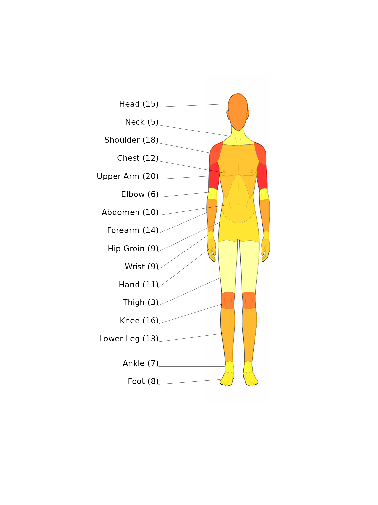
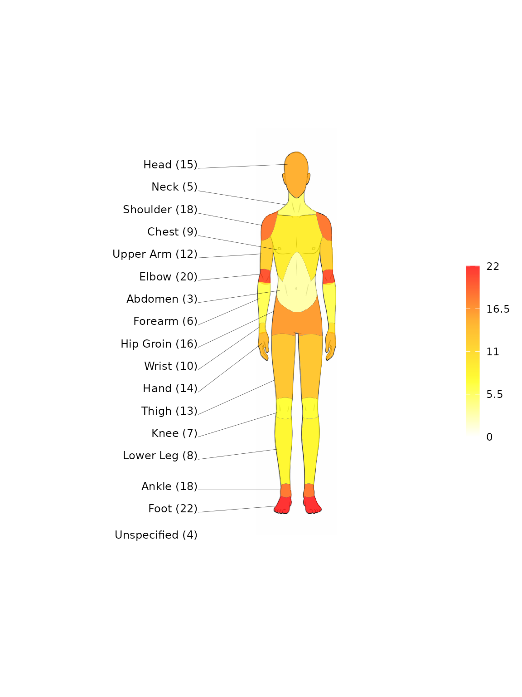

# Get started with spinviz

``` r

library(spinviz)
```

`spinviz` produces two kinds of injury visualisations:

- **Heatmaps** of injury frequency projected onto human-body diagrams
  ([`heatmap_diagram()`](https://thomas-fung.github.io/spinviz/reference/heatmap_diagram.md)),
  with front, back, or both views and male or female body templates.
- **Interactive sunburst diagrams** of tissue/pathology classifications
  ([`sunburst_diagram_echarts()`](https://thomas-fung.github.io/spinviz/reference/sunburst_diagram_echarts.md)),
  built on echarts4r.

## Data format

The package expects a data frame with two descriptor columns followed by
one or more columns of injury frequencies (one per sport or cohort).

### Heatmap data

| region_area   | subcategory | sport1 |
|---------------|-------------|--------|
| Head and Neck | Head        | 10     |
| Head and Neck | Neck        | 20     |
| Upper Limb    | Shoulder    | 5      |
| Upper Limb    | Upper Arm   | 8      |

The 18 recognised body subcategories and their `region_area` groupings,
plus a special `Unspecified` category for injuries that cannot be
localised, are available as the built-in `body_categories` taxonomy (19
rows).

### Sunburst data

For the sunburst, the first two columns are `tissue` and `pathology`:

| tissue          | pathology      | sport1 |
|-----------------|----------------|--------|
| Muscle / Tendon | Muscle strain  | 20     |
| Muscle / Tendon | Tendon rupture | 10     |
| Bone            | Fracture       | 16     |
| Bone            | Bone contusion | 6      |

The built-in `injury_categories` taxonomy contains the 25-row
tissue/pathology classification.

## Heatmap example

``` r

subcategory <- c("Head", "Neck", "Shoulder", "Chest", "Upper Arm", "Elbow",
                 "Abdomen", "Forearm", "Hip Groin", "Wrist", "Hand",
                 "Thigh", "Knee", "Lower Leg", "Ankle", "Foot",
                 "Thoracic Spine", "Lumbosacral")

region_area <- rep("Example", length(subcategory))
boxing <- c(15, 5, 18, 12, 20, 6, 10, 14, 9, 9, 11, 3, 16, 13, 7, 8, 18, 22)

df <- data.frame(region_area, subcategory, boxing)
```

Then call `heatmap_diagram(injury_data, selected_sport, view_choice)`,
where `view_choice` is one of `"front"`, `"back"`, or `"both"`:

``` r

heatmap_diagram(df, "boxing", "front", sex = "male", show_scale = FALSE)
```



See
[`?heatmap_diagram`](https://thomas-fung.github.io/spinviz/reference/heatmap_diagram.md)
for options controlling labels, values, opacity, the legend scale, and
custom palettes. Rows with an `"Unspecified"` subcategory are shown as a
label below the diagram (they have no body region to colour).

## Sunburst example

The quickest way to get a correctly-ordered taxonomy is
`injury_categories`:

``` r

df_sb <- injury_categories
df_sb$boxing <- c(20, 0, 0, 10, 31, 18, 16, 16, 20, 20, 27, 46,
                  67, 31, 54, 20, 27, 30, 96, 82, 48, 26, 33, 34, 24)

sunburst_diagram_echarts(df_sb, "boxing", plot_title = "Boxing Injuries")
```

The sunburst is interactive: tissue types sit on the inner ring,
pathologies on the outer ring. See
[`?sunburst_diagram_echarts`](https://thomas-fung.github.io/spinviz/reference/sunburst_diagram_echarts.md)
for options such as `depth = 1` (tissue ring only), excluding
“Unspecified”/“Non-specific” rows, and label/radius/font tuning.

## Convenience wrappers

If you use the package’s standard classifications, you can skip
constructing the descriptor columns entirely and pass just a vector of
counts:

``` r

heatmap_diagram_default(c(boxing, unspecified = 4), "front")
```



``` r

sunburst_diagram_default(df_sb$boxing, plot_title = "Boxing Injuries")
```

Counts are matched by row position to `body_categories` /
`injury_categories`.

## Next steps

- [Importing CSV
  data](https://thomas-fung.github.io/spinviz/articles/importing-csv-data.md)
  — a template-based CSV workflow
- [Customisation](https://thomas-fung.github.io/spinviz/articles/customisation.md)
  — palettes, saving diagrams, and display options
